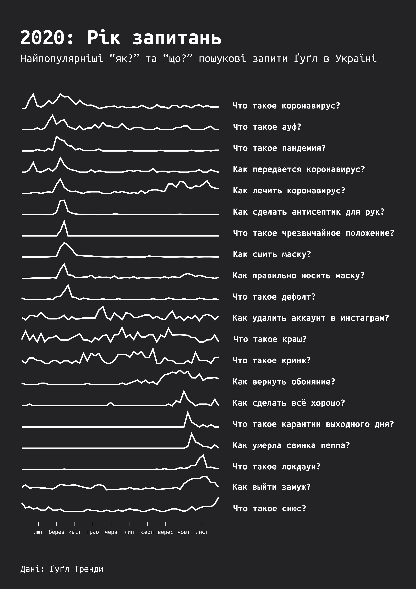

# Google Trends - Ukraine 2020

The project aims to show the most popular Google searches in Ukraine in 2020. Questions ordered by date of peak query.

## The result

## Technologies used

* [Altair](https://altair-viz.github.io/getting_started/overview.html) - a Python library - to generate and group charts.
* [Adobe Illustrator](https://www.adobe.com/uk/products/illustrator.html) - text and style.

## Data source

Data derived from [Google Trends](https://trends.google.com/trends/yis/2020/UA/).